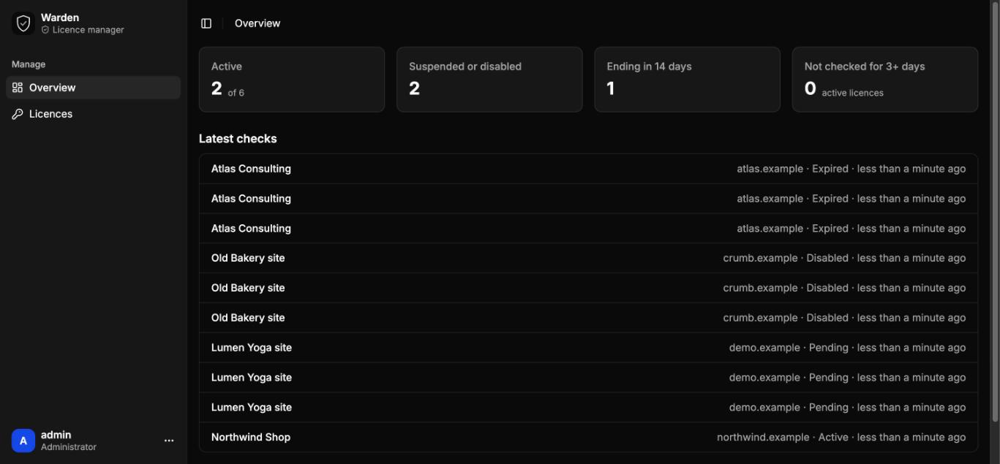
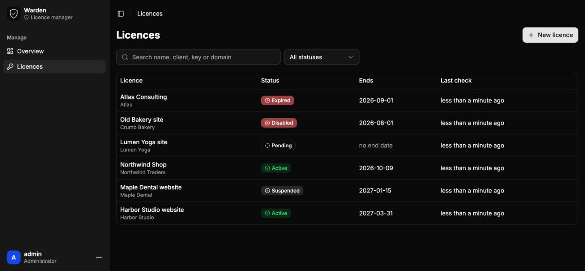
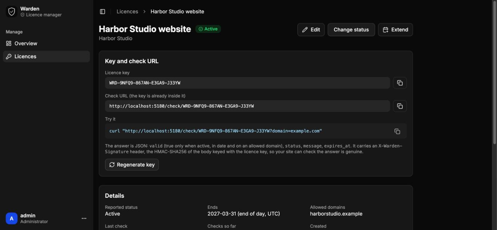
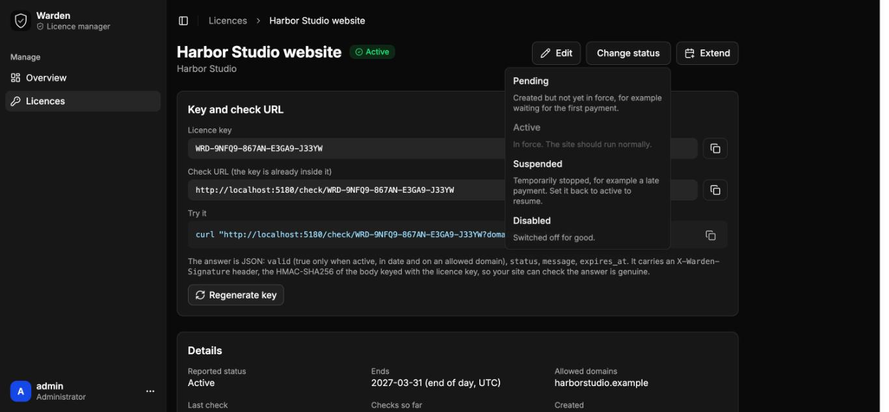
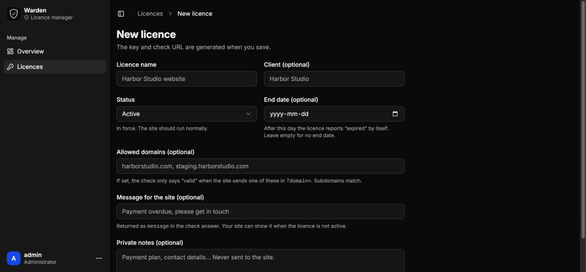
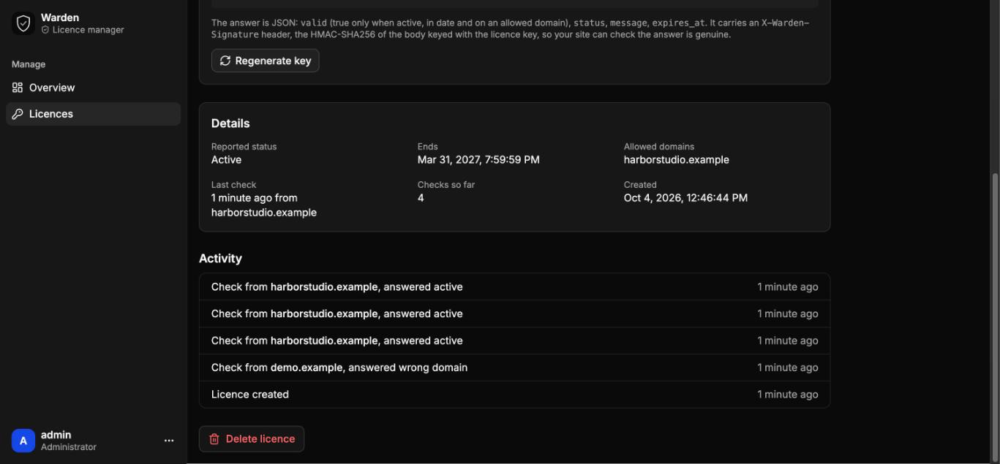
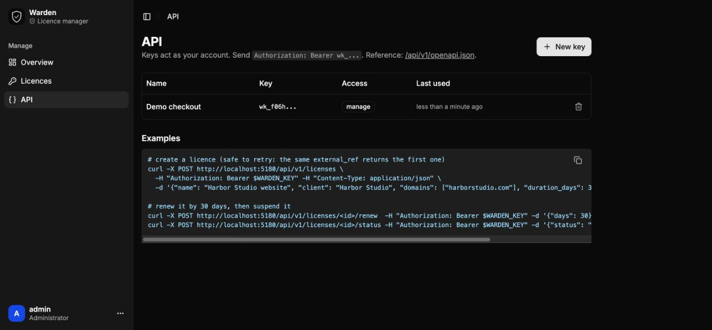

# Warden

**A self-hosted licence manager for Cloudflare Workers.** Create a licence for each client site, get a licence key and a check URL, and switch the licence between active, suspended, disabled or expired from a dashboard or from your own code through an API.

> **Status: pre-1.0 (0.1.x).** It works and is tested, but the API and data model may still change before 1.0.0. See [Roadmap.md](Roadmap.md) and [Security.md](Security.md).



## How it works

1. You create a licence in Warden (or through the API). Warden gives you a **licence key** and a **check URL**.
2. The client's site calls the check URL (for example every 12 hours) and reads the answer: `valid`, `status`, `message`.
3. You change the licence status in the dashboard, or by API. The next time the site checks, it sees the new status and acts on it.

Warden **creates and manages** licences. **Enforcement lives in the site's code**, so you decide what an invalid licence does: show a notice, switch a feature off, show a maintenance page. [docs/checking.md](docs/checking.md) has PHP and JavaScript examples, including how to verify the signed answer.

## Features

- Licence key (`WRD-XXXXX-XXXXX-XXXXX-XXXXX`) and a ready-to-use check URL per licence
- Statuses: **pending, active, suspended, disabled, expired**. An active licence past its end date reports `expired` by itself
- Optional end date, optional allowed domains (subdomains match), a message for the site, private notes
- **Signed answers** (`X-Warden-Signature`, HMAC-SHA256 keyed with the licence key)
- Activity log per licence: every check (which domain, what answer) and every change
- Overview: active count, ending soon, active licences that stopped checking in
- One-click **extend** (30 days, 90 days, 1 year) and **regenerate key**
- **API** with scoped keys, idempotent create, renew, status, search and paging, plus an OpenAPI description
- Single admin login from Worker secrets, no third-party services, runs on the Workers and D1 free plans

| | |
|---|---|
|  |  |
| Licence list with search and status filter | Key, check URL, details, extend |
|  |  |
| Change status | Create a licence |
|  |  |
| Every check and change is logged | API keys and examples |

## The check URL

```
GET https://<your-worker>/check/<licence key>?domain=client-site.org
```

```json
{ "name": "Harbor Studio website", "valid": true, "status": "active", "message": "", "expires_at": "2027-03-31T23:59:59.999Z", "checked_at": "2026-10-04T16:17:30.248Z" }
```

`valid` is `true` only when the status is `active`, the end date has not passed, and the domain matches (if the licence lists domains). Other `status` values: `pending`, `suspended`, `disabled`, `expired`, `domain_mismatch`, `unknown` (HTTP 404). Full details and verification code: [docs/checking.md](docs/checking.md).

Recommended in the site: check about every 12 hours, act only on an answer you could read and verify, and **keep the last known state on network errors or 5xx**, so a Warden outage never locks a client out.

## The API

Create a key on the **API** page of the dashboard and send it as `Authorization: Bearer wk_...`.

```bash
# create a licence (safe to retry: the same external_ref returns the first one)
curl -X POST https://<worker>/api/v1/licenses \
  -H "Authorization: Bearer $WARDEN_KEY" -H "Content-Type: application/json" \
  -d '{"name":"Harbor Studio website","domains":["harborstudio.com"],"duration_days":365,"external_ref":"order-1042"}'

# renew by 30 days, suspend, list what has expired
curl -X POST   https://<worker>/api/v1/licenses/<id or key>/renew  -H "Authorization: Bearer $WARDEN_KEY" -d '{"days":30}'
curl -X POST   https://<worker>/api/v1/licenses/<id or key>/status -H "Authorization: Bearer $WARDEN_KEY" -d '{"status":"suspended"}'
curl           "https://<worker>/api/v1/licenses?status=expired"   -H "Authorization: Bearer $WARDEN_KEY"
```

| Scope | Allows |
|---|---|
| `read` | list, read, stats, activity |
| `manage` | also create, edit, set status, renew |
| `full` | also delete and regenerate keys |

Endpoints: `GET /me`, `GET /stats`, `GET|POST /licenses`, `GET|PATCH|DELETE /licenses/{id}`, `POST /licenses/{id}/status`, `POST /licenses/{id}/renew`, `POST /licenses/{id}/regenerate-key`, `GET /licenses/{id}/activity`. Reference: [docs/api.md](docs/api.md), or `/api/v1/openapi.json` on your own install.

## Run and deploy

Requirements: Node 22 and a Cloudflare account.

```bash
export PATH=/opt/homebrew/opt/node@22/bin:$PATH     # if your default Node is newer than 22
npm install
printf 'ADMIN_USERNAME="admin"\nADMIN_PASSWORD="a-long-password"\n' > .dev.vars
npm run dev          # http://localhost:5173 (local D1 database, migrations applied for you)
npm test             # unit and API tests
```

Deploy to your own account:

```bash
npm run deploy       # builds, creates the D1 database "<worker-name>-db" and a daily Cron Trigger, deploys the Worker
npx wrangler secret put ADMIN_USERNAME
npx wrangler secret put ADMIN_PASSWORD
npx wrangler secret put SESSION_SECRET     # optional but recommended: openssl rand -hex 32
```

The database tables are created and upgraded by the Worker itself on the first request, so there is no migration step. Until the two admin secrets exist, the login page tells you what to add.

Use a custom domain (Workers > your Worker > Settings > Domains) so check URLs do not depend on `workers.dev`.

## Under the hood

React Router 7 (SSR) on Cloudflare Workers, Cloudflare D1, Tailwind and shadcn/ui, TypeScript. One daily Cron Trigger deletes check history older than 90 days. The public check endpoint and the API are served by the Worker before the dashboard, and do not use cookies.

```
workers/app.ts              entry: migrations, /api/v1, /check/<key>, dashboard
app/server/check.server.ts  the check endpoint and its signature
app/server/api.server.ts    API: keys, routes, validation
app/server/licenses.server.ts   licence logic shared by dashboard and API
app/lib/license.ts          statuses, key format, domain rules, the answer
migrations/                 D1 schema
tests/                      node:test, runs the real SQL on a SQLite stand-in for D1
```

## Project files

- [Roadmap.md](Roadmap.md): what is done and what comes before 1.0.0
- [Security.md](Security.md): how it is protected, its limits, how to report a problem
- [CHANGELOG.md](CHANGELOG.md): what changed
- [Licence.md](Licence.md): MIT

The dashboard UI kit (shadcn/ui components, sidebar and layout) is derived from [FormZero](https://github.com/BohdanPetryshyn/formzero) by Bohdan Petryshyn (MIT), and both copyright holders are named in the licence.
